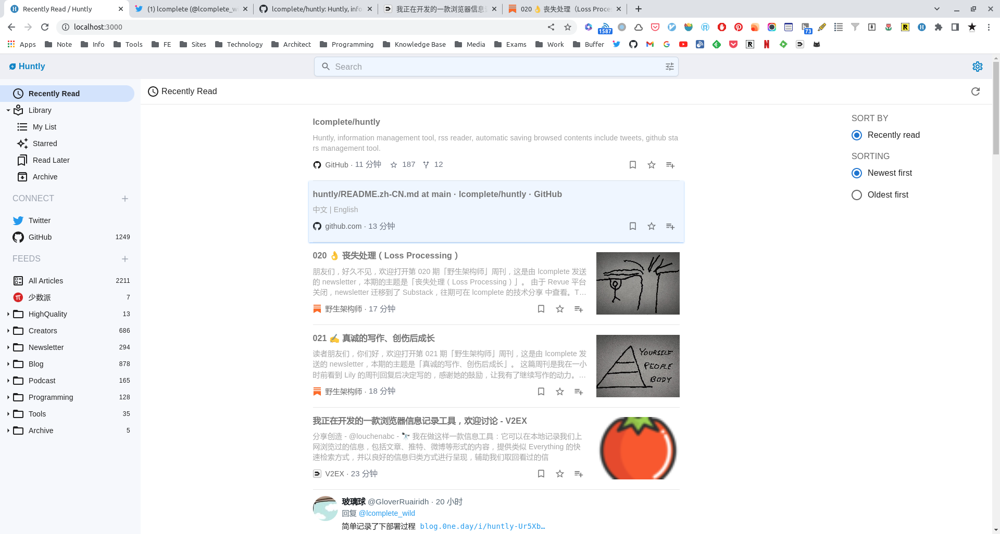

# Huntly

**English** | [中文](./README.md)

## Table of Contents

- [Huntly](#huntly)
  - [Table of Contents](#table-of-contents)
  - [Screenshot](#screenshot)
  - [Requirements](#requirements)
  - [Usage](#usage)
    - [Running the server side](#running-the-server-side)
      - [Using the Server Installation Package](#using-the-server-installation-package)
      - [Run with docker](#run-with-docker)
      - [Run with the Java command](#run-with-the-java-command)
      - [Install as Windows Service](#install-as-windows-service)
    - [Install the browser extension](#install-the-browser-extension)
    - [Browser extension settings](#browser-extension-settings)
    - [Login and enjoy it](#login-and-enjoy-it)
  - [Buy me a coffee](#buy-me-a-coffee)

Huntly is a self-hosted information management tool, in simple terms, contains the following features.

- RSS subscription and reading.
- Automatically saves the pages that have been viewed， then you can saves them as read later, favorites or archives.
- There is a special treatment for Twitter sites that automatically saves the requested tweet timeline, recording whether it has been viewed or not, and in huntly you can even revisit these tweets in a more convenient way.
- You can search by title, content, type, favorite method, and other dimensions.
- Connect to other services, currently GitHub is supported, so it's also a Github stars management tool.
- In the future, it may support connections to services like Pocket, Hypothesis, etc.

## Screenshot




## Requirements

- Java 11

## Usage

### Running the server side
You can run the server using one of the following methods.

#### Using the Server Installation Package

Download the installation package for your corresponding operating system from [Releases](https://github.com/lcomplete/huntly/releases), and run it after installation.

If you encounter the error message "Huntly.app" is damaged and can't be opened. You should move it to the Trash. while installing software on macOS, it may be due to security settings restrictions in macOS. To solve this problem, please try the following command in Terminal:

```sh
sudo xattr -r -d com.apple.quarantine /YOUR_PATH/ChatGPT.app
```

#### Run with docker

```sh
mkdir huntly && cd huntly
docker run -itd --name huntly --restart=always -p <host port>:80 -v `pwd`/data:/data lcomplete/huntly
```

always pull the latest image. if you need to upgrade, you can delete the local latest image and run the startup command again.


#### Run with the Java command

Download the jar package from [Releases](https://github.com/lcomplete/huntly/releases), in which the react client is also packaged.

After downloading, cd to the current directory from the command line and run it with the following Java command.

```sh
java -Xms128m -Xmx1024m -jar huntly-server.jar
```

By default it runs on port 8080, you can open the [http://localhost:8080/](http://localhost:8080/) port for access, or if you need to use another port, such as port 80, you can run the following command.


```sh
java -Xms128m -Xmx1024m -jar huntly-server.jar --server.port=80
```

Note that the Jar package name needs to be modified appropriately according to the downloaded package name.

#### Install as Windows Service

Create a new directory named Huntly, and perform the following operations in this directory.

Download the jar package from [Releases](https://github.com/lcomplete/huntly/releases).

Download [WinSW exe](https://github.com/winsw/winsw/releases) and rename it to `app.exe`.

Create a new file named `app.xml` with the following content:

```xml
<service>
  <id>huntly</id>
  <name>huntly</name>
  <description>huntly</description>
  <executable>java</executable>
  <arguments>-Xms128m -Xmx1024m -jar huntly-server.jar --server.port=8123</arguments>
  <log mode="roll"></log>
</service>
```

After successful startup, you can access [http://localhost:8123](http://localhost:8123).

Open the terminal and run the command:

```sh
.\app.exe install .\app.xml
```

After executing the above command, Huntly has been installed as a Windows service and set to start automatically at boot. It is currently not started. Use the following command to start the service:

```sh
.\app.exe start .\app.xml
```

If you receive an error message that java cannot be executed, change the value of `executable` to the full path of `java.exe`.

Other commands such as uninstall, stop, restart, status, refresh, customize are also supported. For specific usage instructions please refer to [https://github.com/winsw/winsw](https://github.com/winsw/winsw).

### Install the browser extension

The plugin has been uploaded to the Chrome Web Store and can be directly installed from the [Huntly extension page on the Chrome Web Store](https://chrome.google.com/webstore/detail/huntly/cphlcmmpbdkadofgcedjgfblmiklbokm).

If you want to use the latest features, you can download browser-extension.zip from [Releases](https://github.com/lcomplete/huntly/releases) and extract it.

To manage extensions in your browser, enable developer mode and load the unpacked extension.

### Browser extension settings

Click the huntly extension icon, choose to set huntly's server address (home page url), for the remote address, in formal use, it is highly recommended to use the https protocol, after all, the browsing history is quite private. If the server is running locally, then set it to the local address.

### Login and enjoy it

When you open huntly website for the first time, you will be prompted to register an administrator user, currently only single user is supported.

After registration, you will be automatically logged into the system, and the huntly extension will only send browsing history to the server if you are logged in.

Enjoy it.

## Buy me a coffee

<p align="center">
	
	
</p>